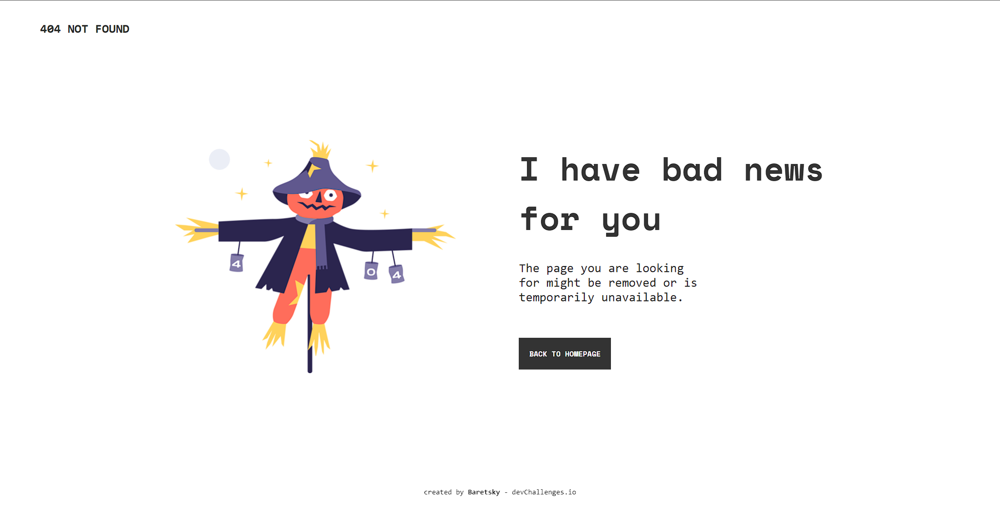

<!-- Please update value in the {}  -->

<h1 align="center">404 NOT FOUND</h1>

   Solution for a challenge from  <a href="http://devchallenges.io" target="_blank">Devchallenges.io</a>.

  <h3>
    <a href="https://404-not-found-challenge-baretsky.netlify.app/">
      Demo
    </a>
     | 
    <a href="https://github.com/Baretsky/404-not-found-challenge">
      Solution
    </a>
     | 
    <a href="https://devchallenges.io/challenges/wBunSb7FPrIepJZAg0sY">
      Challenge
    </a>
  </h3>

## Table of Contents

- [Table of Contents](#table-of-contents)
- [Overview](#overview)
  - [Built With](#built-with)

## Overview

My attempt on the challenge that can be found [here](https://devchallenges.io/challenges/wBunSb7FPrIepJZAg0sY).

### Built With

- HTML
- CSS
